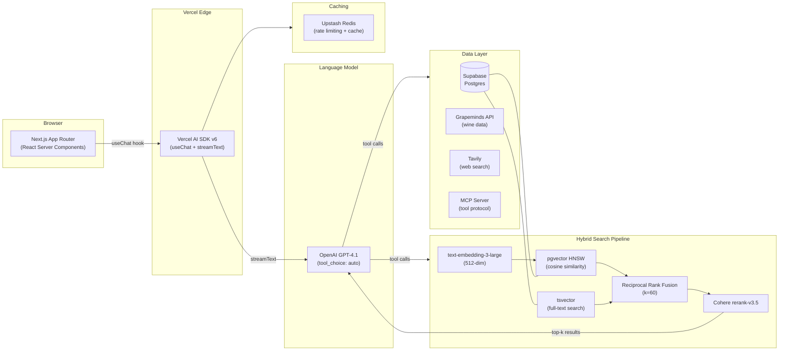

# Vinny — AI Wine Concierge

> Multi-source RAG wine recommendation engine with hybrid search, conversational UX, and multi-tenant B2B SaaS architecture.

---

**This repository documents the architecture and design decisions for Vinny. Source code is available upon request for interview processes.**

📄 [Portfolio Case Study](https://jamesshehan.dev/projects/vinny) · 📝 [Blog Deep Dive](https://jamesshehan.dev/blog/two-tier-rag-ai-wine-concierge) · 🍷 [Live Demo](https://vinny.chat) · 📬 [Request Source Access](mailto:james@jamesshehan.dev?subject=Source%20Access%20Request%20—%20Vinny)

---

## Problem

Wine recommendations are either shallow (filter by price/region) or require expensive sommelier expertise. Existing AI chat tools hallucinate wine names, prices, and tasting notes because they lack grounding in real-time inventory and curated review data. No accessible tool combines multiple authoritative data sources with a conversational experience that adapts to the user's knowledge level.

## Architecture

Vinny uses a **two-tier RAG pipeline** that combines vector similarity search with full-text keyword search, fused via Reciprocal Rank Fusion (RRF), then reranked by a dedicated model for maximum relevance.

| Component | Function |
|-----------|----------|
| **Hybrid Search** | pgvector (semantic) + tsvector (keyword) fused via RRF — catches both conceptual queries ("bold Italian red") and exact lookups ("2019 Barolo") |
| **Reranking** | Cohere rerank-v3.5 re-scores the fused candidate list by query relevance, boosting precision in top-k |
| **Multi-Source Tools** | Grapeminds API (wine database), Tavily (web search), MCP server (extensible tool protocol) |
| **Streaming UX** | Vercel AI SDK `streamText` for token-by-token responses with tool call interleaving |

## Tech Stack

| Technology | Role | Why This Choice |
|-----------|------|-----------------|
| Next.js 16 (App Router) | Frontend & API routes | Server components, streaming, TypeScript strict |
| Vercel AI SDK v6 | LLM orchestration | `streamText`, `useChat`, tool definitions, multi-step agent loops |
| OpenAI GPT-4.1 / GPT-4.1-mini | Language model | Tool-use optimized, Structured Outputs, cost-tiered (mini for simple queries) |
| Supabase (Postgres) | Primary database | pgvector extension for embeddings, row-level security for multi-tenancy |
| pgvector (HNSW, 512-dim) | Vector similarity search | Managed via Supabase, cosine similarity with HNSW indexing |
| tsvector | Full-text keyword search | Native Postgres FTS — zero additional infrastructure |
| Cohere rerank-v3.5 | Search reranking | Dedicated relevance model, improves precision over raw fusion scores |
| Upstash Redis | Rate limiting + caching | Serverless Redis, per-user rate limits, conversation context cache |
| Grapeminds API | Wine data source | Curated wine database with pricing, reviews, and tasting notes |
| Tavily | Web search | Real-time web results for questions beyond the wine database |
| MCP Server | Tool protocol | Model Context Protocol for extensible tool integration |
| Zod v4 | Schema validation | Runtime validation of API responses, tool parameters, and config |

## Technical Challenges & Solutions

### 1. Free-Tier Vector Storage Limits

**Challenge**: Supabase free tier has limited storage. Original `text-embedding-3-large` produces 1536-dimensional vectors — each row consumes significant storage, and HNSW index memory grows proportionally with dimensionality.

**Solution**: Reduced embedding dimensions from 1536 to 512 via OpenAI's native `dimensions` parameter (ADR-004). Rebuilt HNSW index with `ivfflat` → `hnsw` upgrade. 3x storage reduction with minimal recall degradation (measured via evaluation suite).

### 2. Exact Name Queries Miss with Vector Search

**Challenge**: Users frequently search for specific wines by name ("2019 Caymus Cabernet"). Vector search returns semantically similar wines but misses exact string matches — "2019 Caymus" might rank below "2020 Silver Oak" because the embeddings are close in vector space.

**Solution**: Hybrid search architecture (ADR-007). Added `tsvector` full-text search column alongside pgvector. Both search paths run in parallel, results fused via Reciprocal Rank Fusion (RRF, k=60), then reranked by Cohere. Exact name matches now surface reliably while semantic queries still work.

### 3. Multi-Tenant Data Isolation

**Challenge**: B2B SaaS architecture requires per-restaurant data isolation. pgvector HNSW indexes return candidates *before* SQL WHERE filters are applied — a restaurant's query could surface wines from another restaurant's catalog in the candidate set.

**Solution**: Iterative index scans with RLS (ADR-009). Supabase Row-Level Security policies filter at the database level. The hybrid search function applies `tenant_id` filters within the search query itself, not as a post-filter. Combined with connection-level RLS context (`set_config('app.tenant_id', ...)`), isolation is enforced at every layer.

## Key Decisions

| ADR | Decision | Rationale |
|-----|----------|-----------|
| ADR-004 | 512-dim embeddings | 3x storage reduction vs. 1536-dim, minimal recall loss, fits free-tier limits |
| ADR-007 | Hybrid Search (pgvector + tsvector + RRF) | Vector alone misses exact-match; keyword alone misses semantic; fusion catches both |
| ADR-008 | Automated Evaluation Framework | Regression suite with test queries, expected results, and scored metrics for search quality |
| ADR-009 | Multi-Tenant Data Model | Row-Level Security + tenant_id partitioning for B2B SaaS isolation |
| ADR-011 | Consumer Anonymous Access | Guest users get rate-limited access without auth; conversion funnel optimization |
| ADR-012 | Staff Mode | Restaurant staff get elevated access (inventory management, analytics) via role-based permissions |

See [docs/tech-decisions.md](docs/tech-decisions.md) for detailed ADR excerpts.

## Results

- **19 development phases** completed
- **107K+ data sources** integrated (wine reviews, tasting notes, pricing)
- **Hybrid search pipeline** with measured precision improvements over vector-only
- **MCP server** for extensible tool integration
- **Multi-tenant B2B SaaS** architecture with Row-Level Security
- **Live at [vinny.chat](https://vinny.chat)** with anonymous guest access

## Project Status

| Phase | Status | Description |
|-------|--------|-------------|
| Phases 1–19 | ✅ | Core RAG, hybrid search, reranking, multi-source tools, streaming UX |
| Multi-Tenant B2B | ✅ | Architecture designed, RLS policies implemented, tenant isolation verified |
| MCP Server | ✅ | Model Context Protocol server functional |
| Staff Mode | ✅ | Role-based permissions, inventory management, analytics dashboard |

---

**Built by [James Shehan](https://jamesshehan.dev)** · TPM / Solutions Architect

📬 [Request source code access](mailto:james@jamesshehan.dev?subject=Source%20Access%20Request%20—%20Vinny) for interview review
