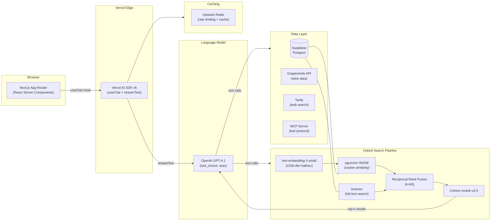

# Vinny: AI Beverage Concierge

> Multi-source RAG beverage recommendation engine with hybrid search, multi-category data model (wine, beer, spirits, cocktails), cross-category food pairings, conversational UX, and multi-tenant B2B SaaS architecture.

---

**This repository documents the architecture and design decisions for Vinny. Source code is available on request.**

📄 [Portfolio Case Study](https://jamesshehan.dev/projects/vinny) · 📝 [Blog Deep Dive](https://jamesshehan.dev/blog/two-tier-rag-ai-wine-concierge) · 🍷 [Live Demo](https://vinny-v2-murex.vercel.app/) · 📬 [Request Source Access](mailto:james@jamesshehan.dev?subject=Source%20Access%20Request%20-%20Vinny)

---

## Problem

Wine recommendations are either shallow (filter by price/region) or require expensive sommelier expertise. Existing AI chat tools hallucinate wine names, prices, and tasting notes because they lack grounding in real-time inventory and curated review data. No accessible tool combines multiple authoritative data sources with a conversational experience that adapts to the user's knowledge level.

## Architecture

Vinny uses a **two-tier RAG pipeline** that combines vector similarity search with full-text keyword search, fused via Reciprocal Rank Fusion (RRF), then reranked by a dedicated model for maximum relevance.

| Component | Function |
|-----------|----------|
| **Hybrid Search** | pgvector (semantic) + tsvector (keyword) fused via RRF, catches both conceptual queries ("bold Italian red") and exact lookups ("2019 Barolo") |
| **Reranking** | Cohere rerank-v3.5 re-scores the fused candidate list by query relevance, boosting precision in top-k |
| **Multi-Category Schema** | Separate `wines`, `beers`, `spirits`, `cocktails` tables (each with its own HNSW index and hybrid search RPC): vector spaces stay semantically coherent, RPCs stay type-safe, schemas evolve independently |
| **Multi-Source Tools** | Grapeminds (wine), WineVybe (beer + spirits), TheCocktailDB, Open Brewery DB, Tavily web search, MCP server (extensible tool protocol) |
| **Streaming UX** | Vercel AI SDK `streamText` for token-by-token responses with tool call interleaving |

## Tech Stack

| Technology | Role | Why This Choice |
|-----------|------|-----------------|
| Next.js 16 (App Router) | Frontend & API routes | Server components, streaming, TypeScript strict |
| Vercel AI SDK v6 | LLM orchestration | `streamText`, `useChat`, tool definitions, multi-step agent loops |
| OpenAI GPT-4.1 / GPT-4.1-mini | Language model | Tool-use optimized, Structured Outputs, cost-tiered (mini for simple queries) |
| Supabase (Postgres) | Primary database | pgvector extension for embeddings, row-level security for multi-tenancy |
| pgvector (HNSW, 1536-dim halfvec) | Vector similarity search | Managed via Supabase, cosine similarity with HNSW indexing |
| tsvector | Full-text keyword search | Native Postgres FTS, zero additional infrastructure |
| Cohere rerank-v3.5 | Search reranking | Dedicated relevance model, improves precision over raw fusion scores |
| Upstash Redis | Rate limiting + caching | Serverless Redis, per-user rate limits, conversation context cache |
| X-Wines dataset (CC0) | Wine catalog source | ~100K openly licensed wines, clean for commercial use |
| Grapeminds API | Live wine API | Curated wine database with pricing, reviews, and tasting notes |
| WineVybe API | Beer + spirits data | Primary source of record for beer (IBU/SRM/style) and spirits (proof/age/cask) catalog data |
| TheCocktailDB | Cocktail data | Multi-ingredient filtering, glassware, technique, family |
| Open Brewery DB | Brewery metadata | 9,527 breweries, free, no auth |
| Tavily | Web search | Real-time web results for questions beyond the local catalog |
| MCP Server | Tool protocol | Model Context Protocol for extensible tool integration |
| Zod v4 | Schema validation | Runtime validation of API responses, tool parameters, and config |

## Technical Challenges & Solutions

### 1. Free-Tier Vector Storage Limits

**Challenge**: Supabase free tier has limited storage. `text-embedding-3-small` produces 1536-dimensional vectors natively, each row consumes significant storage, and HNSW index memory grows proportionally with dimensionality.

**Solution**: First reduced embedding dimensions to 512 via OpenAI's native `dimensions` parameter (ADR-004) for a 3x storage reduction with minimal recall loss (measured via the evaluation suite). Later modernized to the full native 1536 dimensions stored as Postgres `halfvec(1536)`: half-precision (2 bytes per component) keeps the larger vectors affordable while restoring full retrieval fidelity.

### 2. Exact Name Queries Miss with Vector Search

**Challenge**: Users frequently search for specific wines by name ("2019 Caymus Cabernet"). Vector search returns semantically similar wines but misses exact string matches: "2019 Caymus" might rank below "2020 Silver Oak" because the embeddings are close in vector space.

**Solution**: Hybrid search architecture (ADR-007). Added `tsvector` full-text search column alongside pgvector. Both search paths run in parallel, results fused via Reciprocal Rank Fusion (RRF, k=60), then reranked by Cohere. Exact name matches now surface reliably while semantic queries still work.

### 3. Multi-Tenant Data Isolation

**Challenge**: B2B SaaS architecture requires per-restaurant data isolation. pgvector HNSW indexes return candidates *before* SQL WHERE filters are applied, so a restaurant's query could surface wines from another restaurant's catalog in the candidate set.

**Solution**: Iterative index scans with RLS (ADR-009). Supabase Row-Level Security policies filter at the database level. The hybrid search function applies `tenant_id` filters within the search query itself, not as a post-filter. Combined with connection-level RLS context (`set_config('app.tenant_id', ...)`), isolation is enforced at every layer.

### 4. Multi-Category Without a Polymorphic Mess

**Challenge**: Phase 17 expanded Vinny from wine-only to wine + beer + spirits + cocktails. The naive design is a polymorphic `beverages` table with a category discriminator and a wide column set. That approach falls apart fast: wine has 15+ wine-specific columns (`points`, `variety`, `winery`, `body`, `acidity`, `harmonize`), beer needs `ibu`/`srm`/`style`, spirits need `proof`/`age_statement`/`cask_type`, cocktails need `ingredients` JSONB, `technique`, `glassware`, `family`. A unified table ends up with 50+ mostly-NULL columns and degraded index efficiency. Worse, a unified HNSW index mixes wine vectors into "hoppy IPA" candidate sets, degrading recall.

**Solution**: Separate tables per category (ADR-014). `wines`, `beers`, `spirits`, `cocktails` each get typed columns, dedicated HNSW vector indexes, GIN FTS indexes, and category-specific hybrid search RPCs. Vector spaces stay semantically coherent. RPCs stay type-safe. Cross-category queries (e.g., "what pairs with steak?") are handled by the `search_beverage_pairings` RPC against a `food_pairings` table unified by a `beverage_domain` column. The LLM sees one `search_beverages` tool with a category discriminator; the backend fans out. Tenant-scoped `enabledCategories` config gates which categories each tenant exposes. Migration is purely additive: the existing `wines` table and `hybrid_search_wines` RPC are never touched.

## Key Decisions

| ADR | Decision | Rationale |
|-----|----------|-----------|
| ADR-004 | Embedding dimensions | Started 512-dim for free-tier storage, later native 1536-dim stored as halfvec(1536) for full fidelity |
| ADR-007 | Hybrid Search (pgvector + tsvector + RRF) | Vector alone misses exact-match; keyword alone misses semantic; fusion catches both |
| ADR-008 | Automated Evaluation Framework | Regression suite with test queries, expected results, and scored metrics for search quality |
| ADR-009 | Multi-Tenant Data Model | Row-Level Security + tenant_id partitioning for B2B SaaS isolation |
| ADR-011 | Consumer Anonymous Access | Guest users get rate-limited access without auth; conversion funnel optimization |
| ADR-012 | Staff Mode | Restaurant staff get elevated access (inventory management, analytics) via role-based permissions |
| ADR-013 | Integration Hub Strategy (don't build middleware) | Design clean API surfaces (OpenAPI + webhooks + OAuth2) so Vinny plugs into Olo/Toast/Provi via existing hubs instead of becoming one |
| ADR-014 | Multi-Category Schema (separate tables) | Polymorphic `beverages` would collapse under column divergence; separate tables preserve vector-space coherence, RPC type safety, and additive migrations |

See [docs/tech-decisions.md](docs/tech-decisions.md) for detailed ADR excerpts.

## Results

- **21 development phases** complete plus Phase 17 multi-category in active rollout
- **~100K wine catalog (CC0 X-Wines) + 5K+ food pairings**, with the multi-category schema (beer, spirits, cocktails) live and category data ingestion in progress
- **Hybrid search pipeline** with measured precision improvements over vector-only
- **Multi-category data model**: separate `wines`/`beers`/`spirits`/`cocktails` tables with dedicated HNSW indexes and per-category hybrid search RPCs
- **MCP server** for extensible tool integration
- **Multi-tenant B2B SaaS** architecture with Row-Level Security
- **Staff Mode MVP** with role-based access, inventory management, and analytics dashboards
- **[Live demo on Vercel](https://vinny-v2-murex.vercel.app/)** with anonymous guest access

## Project Status

| Phase | Status | Description |
|-------|--------|-------------|
| Phases 1-11 | ✅ | Core RAG, hybrid search (FTS + vector + RRF + Cohere reranking), food pairing engine, Grapeminds live API |
| Phase 15: Multi-Tenant Foundation | ✅ | Tenant schema, RLS policies, slug routing, tenant-scoped chat |
| Phase 15.5: Pre-Pilot Legal & Safety | ✅ | Terms of service, allergens, rate limit hardening, steering disclosure |
| Phase 16: Staff Mode MVP | ✅ | Dual-persona prompt, staff tools, role detection |
| Phase 17.1: Multi-Category Infrastructure | ✅ | Separate `beers`/`spirits`/`cocktails` tables, dedicated HNSW indexes, per-category hybrid search RPCs |
| Phase 17.2-17.7: Category Data + Tools | 🚧 | WineVybe, TheCocktailDB, Open Brewery DB ingestion; `search_beverages` unified tool; cross-category food pairings |
| Phase 19: Analytics Foundation | ✅ | Event logging, metrics queries, API routes |
| Phase 20-21: Steering + Admin Dashboard | ✅ | Operational AI behavior controls, wine CRUD, steering UI, analytics |
| MCP Server | ✅ | Model Context Protocol server functional |

---

**Built by [James Shehan](https://jamesshehan.dev)** · TPM / Solutions Architect

📬 [Request source access](mailto:james@jamesshehan.dev?subject=Source%20Access%20Request%20-%20Vinny)
