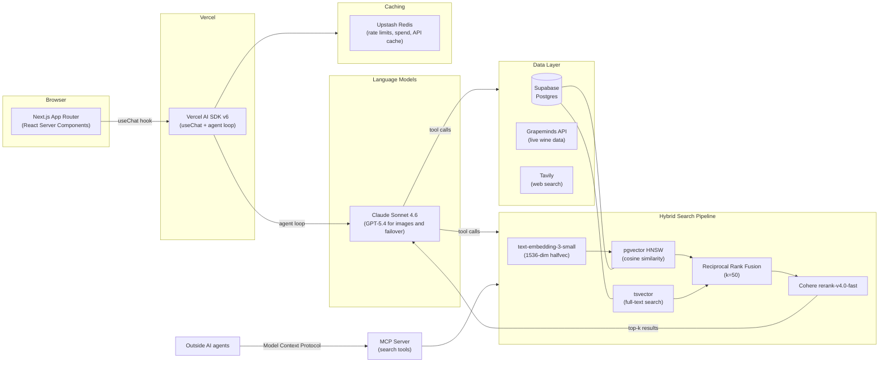

# Vinny: AI Beverage Concierge

> A personal project: a live AI wine and beverage concierge that recommends a bottle and says why. Its search matches on meaning and on keywords, then reranks the results, and outside AI agents can query it over the Model Context Protocol (MCP).

---

**This repository documents the architecture and design decisions for Vinny. The implementation is private.**

[Portfolio case study](https://jamesshehan.dev/projects/vinny) · [Blog post](https://jamesshehan.dev/blog/two-tier-rag-ai-wine-concierge) · [Live demo](https://vinny-v2-murex.vercel.app/)

---

## Problem

Most wine recommendations either filter by price and region or depend on a sommelier being on hand. General AI chat tools can invent wine names, prices and tasting notes because they are not grounded in real inventory and curated wine data. Vinny combines several sources of wine data with a conversation that adapts to the user's knowledge level.

## Architecture

Vinny looks up real data before it answers, instead of answering from memory (retrieval-augmented generation, or RAG). Its **two-tier RAG pipeline** searches a bottle catalog and a wine-knowledge library by meaning (vector similarity) and by keyword (full-text search), merges the results with Reciprocal Rank Fusion (RRF) and has a dedicated model rerank them.

```mermaid
flowchart LR
    subgraph Client["Browser"]
        UI["Next.js App Router<br/>(React Server Components)"]
    end

    subgraph Edge["Vercel"]
        AI["Vercel AI SDK v6<br/>(useChat + agent loop)"]
    end

    subgraph LLM["Language Models"]
        Chat["Claude Sonnet 4.6<br/>(GPT-5.4 for images and failover)"]
    end

    subgraph RAG["Hybrid Search Pipeline"]
        EMB["text-embedding-3-small<br/>(1536-dim halfvec)"]
        VEC["pgvector HNSW<br/>(cosine similarity)"]
        FTS["tsvector<br/>(full-text search)"]
        RRF["Reciprocal Rank Fusion<br/>(k=50)"]
        RR["Cohere rerank-v4.0-fast"]
    end

    subgraph Data["Data Layer"]
        SB[("Supabase<br/>Postgres")]
        GM["Grapeminds API<br/>(live wine data)"]
        WEB["Tavily<br/>(web search)"]
    end

    subgraph Cache["Caching"]
        Redis["Upstash Redis<br/>(rate limits, spend, API cache)"]
    end

    Agents["Outside AI agents"] -->|Model Context Protocol| MCP["MCP Server<br/>(search tools)"]

    UI -->|useChat hook| AI
    AI -->|agent loop| Chat
    Chat -->|tool calls| RAG
    EMB --> VEC
    VEC --> RRF
    FTS --> RRF
    RRF --> RR
    RR -->|top-k results| Chat
    Chat -->|tool calls| Data
    MCP --> RAG
    SB --- VEC
    SB --- FTS
    AI --> Cache
```

| Component | Function |
|-----------|----------|
| **Hybrid Search** | pgvector (semantic) + tsvector (keyword) fused via RRF, catches both conceptual queries ("bold Italian red") and exact lookups ("2019 Barolo") |
| **Reranking** | Cohere rerank-v4.0-fast re-scores the fused candidate list by query relevance, boosting precision in top-k |
| **Multi-Category Schema** | Separate `wines`, `beers`, `spirits`, `cocktails` tables (each with its own HNSW index and hybrid search RPC): vector spaces stay semantically coherent, RPCs stay type-safe, schemas evolve independently |
| **Data Sources** | X-Wines catalog (wine), Wikipedia wine articles (knowledge library), Catalog.beer (beer), Wikidata (spirits), TheCocktailDB and the IBA list (cocktails), Grapeminds live wine API, Tavily web search |
| **Streaming UX** | Vercel AI SDK agent loop streams token-by-token responses with tool calls interleaved |

## Tech Stack

| Technology | Role | Why This Choice |
|-----------|------|-----------------|
| Next.js 16 (App Router) | Frontend & API routes | Server components, streaming, TypeScript strict |
| Vercel AI SDK v6 | LLM orchestration | Tool-loop agent, `useChat`, tool definitions, provider failover |
| Claude Sonnet 4.6 / GPT-5.4 / Claude Haiku 4.5 | Language models | Sonnet answers by default with prompt caching; GPT-5.4 reads images and takes over if the Anthropic call fails before streaming starts; Haiku is the cheaper model a venue drops to past an optional monthly spend cap |
| Supabase (Postgres) | Primary database | pgvector extension for embeddings, row-level security on each venue's tables |
| pgvector (HNSW, 1536-dim halfvec) | Vector similarity search | Managed via Supabase, cosine similarity with HNSW indexing |
| tsvector | Full-text keyword search | Native Postgres FTS, zero additional infrastructure |
| Cohere rerank-v4.0-fast | Search reranking | Dedicated relevance model, improves precision over raw fusion scores |
| Upstash Redis | Rate limiting + caching | Serverless Redis for rate limits, cached live wine-API responses and per-venue spend tracking |
| X-Wines dataset (CC0) | Wine catalog source | ~100K openly licensed (CC0) wines |
| Grapeminds API | Live wine API | Professional tasting notes, drinking windows, region insights and flavor profiles |
| Catalog.beer (CC-BY-4.0) | Beer catalog | Openly licensed beer data; the ingest and in-app attribution are built, the load is pending |
| Wikidata (CC0) | Spirits catalog | Openly licensed spirit products: whisky, gin, rum, tequila, vodka, brandy |
| TheCocktailDB + IBA list | Cocktail data | Ingredients, glassware, technique, family; the load is pending |
| Tavily | Web search | Real-time web results for questions beyond the local catalog |
| MCP Server | Tool protocol | Exposes `search_wines`, `search_beverages`, `search_food_pairings` and `search_web` to outside AI agents |
| Zod v4 | Schema validation | Runtime validation of API responses, tool parameters, and config |

## Technical Challenges & Solutions

### 1. Vector Storage Efficiency

**Challenge**: `text-embedding-3-small` produces 1536-dimensional vectors natively; each row consumes storage and HNSW index memory grows with dimensionality, so storage and index memory grow quickly.

**Solution**: First reduced embedding dimensions to 512 via OpenAI's native `dimensions` parameter, a 3x storage reduction. Later moved to the full native 1536 dimensions stored as Postgres `halfvec(1536)`: half-precision (2 bytes per component) keeps the larger vectors affordable while keeping every dimension.

### 2. Exact Name Queries Miss with Vector Search

**Challenge**: People often search for a specific wine by name ("2019 Caymus Cabernet"). Vector search returns semantically similar wines but misses exact string matches: "2019 Caymus" might rank below "2020 Silver Oak" because the embeddings are close in vector space.

**Solution**: Hybrid search architecture (ADR-007). Added `tsvector` full-text search column alongside pgvector. Both searches run inside one database function, results fused via Reciprocal Rank Fusion (RRF, k=50), then reranked by Cohere. Exact name matches now surface the named wine while semantic queries still work.

### 3. Per-Venue Data Isolation

**Challenge**: Vinny is designed to serve more than one venue, and each venue's menu has to stay apart from every other venue's. pgvector HNSW indexes return candidates *before* SQL WHERE filters are applied, so a small venue's search over a large shared index can come back with only a handful of matches.

**Solution**: A separate per-venue menu table plus iterative index scans (ADR-009, ADR-011). The shared wine catalog stays global and public; venue menus live in a separate `tenant_wines` table keyed by venue. A venue's search runs against the global index, keeps only that venue's wines, and turns on pgvector's iterative index scans so the index keeps fetching candidates when that filter removes too many. Signed-in venue admins reach menu data through row-level security; guests who scan a QR code go through a server route that resolves the venue from its URL slug and passes the venue id explicitly to every query.

### 4. Multi-Category Without One Wide Table

**Challenge**: The multi-category work expanded Vinny from wine-only to wine + beer + spirits + cocktails. The naive design is a polymorphic `beverages` table with a category discriminator and a wide column set. That approach does not hold up: wine has 15+ wine-specific columns (`points`, `variety`, `winery`, `body`, `acidity`, `harmonize`), beer needs `ibu`/`srm`/`style`, spirits need `proof`/`age_statement`/`cask_type`, cocktails need `ingredients` JSONB, `technique`, `glassware`, `family`. A unified table ends up with 50+ mostly-NULL columns and degraded index efficiency. Worse, a unified HNSW index mixes wine vectors into "hoppy IPA" candidate sets, degrading recall.

**Solution**: Separate tables per category (ADR-014). `wines`, `beers`, `spirits`, `cocktails` each get typed columns, dedicated HNSW vector indexes, GIN FTS indexes, and category-specific hybrid search RPCs. Vector spaces stay semantically coherent. RPCs stay type-safe. Cross-category pairing questions (e.g., "what pairs with steak?") get their own `search_beverage_pairings` RPC over a `food_pairings` table unified by a `beverage_domain` column, built ahead of its chat tool. The model sees one `search_beverages` tool with a category parameter, and the backend dispatches to the matching search function. A per-venue `enabledCategories` setting gates which categories each venue exposes. Migration is purely additive: the existing `wines` table and `hybrid_search_wines` RPC are never touched.

## Key Decisions

ADR = architecture decision record: a short written note of each design choice and its reasoning. Excerpts are in [docs/tech-decisions.md](docs/tech-decisions.md).

| ADR | Decision | Rationale |
|-----|----------|-----------|
| ADR-004 | Keep vintage years in embedding text | A year is a weak signal in the vector path but carries vintage character; the prompt decides how to present it |
| ADR-007 | Hybrid Search (pgvector + tsvector + RRF) | Vector alone misses exact-match; keyword alone misses semantic; fusion catches both |
| ADR-008 | Evaluation framework | A live eval suite fails on a drop in wine recall against a committed baseline, or on any named bottle missing from the catalog |
| ADR-009 | Separate venue-menu table | The shared catalog stays global; venue menus sit in a separate table keyed by venue, behind row-level security, with iterative index scans for small menus |
| ADR-010 | Provider abstraction via AI SDK v6 | One factory picks the chat model, so moving the default to Claude Sonnet 4.6 with automatic GPT-5.4 failover was a configuration change |
| ADR-011 | Two-path access | Guests scan a QR code and chat without an account, scoped to the venue on the server; venue admins sign in and go through row-level security |
| ADR-012 | Staff Mode | Staff and owners get a concise staff persona and staff-only tools in the same chat |
| ADR-013 | Integration strategy | Commit to standard interfaces (OpenAPI, webhooks, OAuth2), planned ahead of the first partner integrations, instead of building middleware |
| ADR-014 | Multi-Category Schema (separate tables) | Polymorphic `beverages` would collapse under column divergence; separate tables preserve vector-space coherence, RPC type safety, and additive migrations |

## Results

- **Schema and search extended to beer, spirits and cocktails behind one `search_beverages` tool**, also open to outside agents over MCP; the spirits catalog is loaded, and the beer and cocktail loads are pending
- **~100K wine catalog (CC0 X-Wines) + 5K+ food pairings**
- **Hybrid search pipeline** (vector + keyword + Cohere reranking) instead of vector search alone
- **Multi-category data model**: separate `wines`/`beers`/`spirits`/`cocktails` tables with dedicated HNSW indexes and per-category hybrid search RPCs
- **MCP server** so outside AI agents can query the catalog
- **Row-level security** on venue and user tables, with anonymous guest traffic scoped to its venue by the server route
- **[Live demo on Vercel](https://vinny-v2-murex.vercel.app/)** with anonymous guest access

## Project Status

| Phase | Status | Description |
|-------|--------|-------------|
| Core search and pairing | Done | Core RAG, hybrid search (FTS + vector + RRF + Cohere reranking), food pairing engine, Grapeminds live API |
| Multi-venue foundation | Done | Venue schema, RLS policies, slug routing, venue-scoped chat |
| Safety hardening | Done | Allergens, rate limit hardening, steering disclosure |
| Staff mode | Done | Dual-persona prompt, staff tools, role detection |
| Multi-category infrastructure | Done | Separate `beers`/`spirits`/`cocktails` tables, dedicated HNSW indexes, per-category hybrid search RPCs |
| Unified beverage search | Done | `search_beverages` tool and per-category search functions for all four categories, per-venue `enabledCategories`, also served over MCP (beer and cocktail data still pending) |
| Category data and pairings | In progress | Spirits catalog loaded from Wikidata; Catalog.beer and TheCocktailDB + IBA ingests built, data not yet loaded; cross-category pairing search built in the database, not yet a chat tool |
| Analytics foundation | Done | Event logging, metrics queries, API routes |
| Steering and admin dashboard | Done | Operational AI behavior controls, wine CRUD, steering UI, analytics |
| MCP server | Done | Search tools exposed to outside AI agents over the Model Context Protocol |

---

**Built by [James Shehan](https://jamesshehan.dev)**

