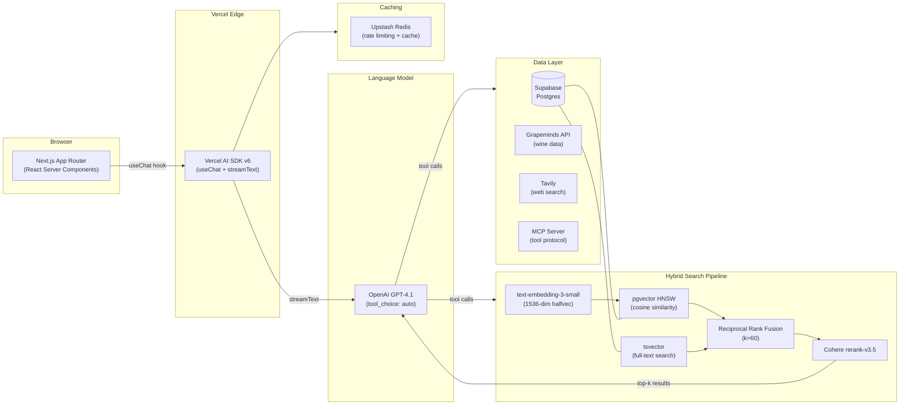

# Vinny: AI Beverage Concierge

> A personal project: a live AI wine and beverage concierge that recommends a bottle and says why. Its search matches on meaning and on keywords, then reranks the results, and outside AI agents can query it over the Model Context Protocol (MCP).

---

**This repository documents the architecture and design decisions for Vinny. The implementation is private.**

[Portfolio case study](https://jamesshehan.dev/projects/vinny) · [Blog post](https://jamesshehan.dev/blog/two-tier-rag-ai-wine-concierge) · [Live demo](https://vinny-v2-murex.vercel.app/)

---

## Problem

Most wine recommendations either filter by price and region or depend on a sommelier being on hand. General AI chat tools can invent wine names, prices and tasting notes because they are not grounded in real inventory and curated review data. Vinny combines several sources of wine data with a conversation that adapts to the user's knowledge level.

## Architecture

Vinny looks up real data before it answers, instead of answering from memory (retrieval-augmented generation, or RAG). Its **two-tier RAG pipeline** searches a bottle catalog and a wine-knowledge library by meaning (vector similarity) and by keyword (full-text search), merges the results with Reciprocal Rank Fusion (RRF) and has a dedicated model rerank them.

```mermaid
flowchart LR
    subgraph Client["Browser"]
        UI["Next.js App Router\n(React Server Components)"]
    end

    subgraph Edge["Vercel Edge"]
        AI["Vercel AI SDK v6\n(useChat + streamText)"]
    end

    subgraph LLM["Language Model"]
        GPT["OpenAI GPT-4.1\n(tool_choice: auto)"]
    end

    subgraph RAG["Hybrid Search Pipeline"]
        EMB["text-embedding-3-small\n(1536-dim halfvec)"]
        VEC["pgvector HNSW\n(cosine similarity)"]
        FTS["tsvector\n(full-text search)"]
        RRF["Reciprocal Rank Fusion\n(k=60)"]
        RR["Cohere rerank-v3.5"]
    end

    subgraph Data["Data Layer"]
        SB[("Supabase\nPostgres")]
        GM["Grapeminds API\n(wine data)"]
        WEB["Tavily\n(web search)"]
        MCP["MCP Server\n(tool protocol)"]
    end

    subgraph Cache["Caching"]
        Redis["Upstash Redis\n(rate limiting + cache)"]
    end

    UI -->|useChat hook| AI
    AI -->|streamText| GPT
    GPT -->|tool calls| RAG
    EMB --> VEC
    VEC --> RRF
    FTS --> RRF
    RRF --> RR
    RR -->|top-k results| GPT
    GPT -->|tool calls| Data
    SB --- VEC
    SB --- FTS
    AI --> Cache
```

| Component | Function |
|-----------|----------|
| **Hybrid Search** | pgvector (semantic) + tsvector (keyword) fused via RRF, catches both conceptual queries ("bold Italian red") and exact lookups ("2019 Barolo") |
| **Reranking** | Cohere rerank-v3.5 re-scores the fused candidate list by query relevance, boosting precision in top-k |
| **Multi-Category Schema** | Separate `wines`, `beers`, `spirits`, `cocktails` tables (each with its own HNSW index and hybrid search RPC): vector spaces stay semantically coherent, RPCs stay type-safe, schemas evolve independently |
| **Multi-Source Tools** | Grapeminds (wine), WineVybe (beer + spirits), TheCocktailDB, Open Brewery DB, Tavily web search, MCP server (extensible tool protocol) |
| **Streaming UX** | Vercel AI SDK `streamText` for token-by-token responses with tool call interleaving |

## Tech Stack

| Technology | Role | Why This Choice |
|-----------|------|-----------------|
| Next.js 16 (App Router) | Frontend & API routes | Server components, streaming, TypeScript strict |
| Vercel AI SDK v6 | LLM orchestration | `streamText`, `useChat`, tool definitions, multi-step agent loops |
| OpenAI GPT-4.1 / GPT-4.1-mini | Language model | Tool-use optimized, Structured Outputs, cost-tiered (mini for simple queries) |
| Supabase (Postgres) | Primary database | pgvector extension for embeddings, row-level security keeps each venue's data separate |
| pgvector (HNSW, 1536-dim halfvec) | Vector similarity search | Managed via Supabase, cosine similarity with HNSW indexing |
| tsvector | Full-text keyword search | Native Postgres FTS, zero additional infrastructure |
| Cohere rerank-v3.5 | Search reranking | Dedicated relevance model, improves precision over raw fusion scores |
| Upstash Redis | Rate limiting + caching | Serverless Redis, per-user rate limits, conversation context cache |
| X-Wines dataset (CC0) | Wine catalog source | ~100K openly licensed (CC0) wines |
| Grapeminds API | Live wine API | Curated wine database with pricing, reviews, and tasting notes |
| WineVybe API | Beer + spirits data | Primary source of record for beer (IBU/SRM/style) and spirits (proof/age/cask) catalog data |
| TheCocktailDB | Cocktail data | Multi-ingredient filtering, glassware, technique, family |
| Open Brewery DB | Brewery metadata | 9,527 breweries, free, no auth |
| Tavily | Web search | Real-time web results for questions beyond the local catalog |
| MCP Server | Tool protocol | Model Context Protocol for extensible tool integration |
| Zod v4 | Schema validation | Runtime validation of API responses, tool parameters, and config |

## Technical Challenges & Solutions

### 1. Vector Storage Efficiency at Scale

**Challenge**: `text-embedding-3-small` produces 1536-dimensional vectors natively; each row consumes storage and HNSW index memory grows with dimensionality, so storage and index memory grow quickly.

**Solution**: First reduced embedding dimensions to 512 via OpenAI's native `dimensions` parameter (ADR-004) for a 3x storage reduction with minimal recall loss (measured via the evaluation suite). Later modernized to the full native 1536 dimensions stored as Postgres `halfvec(1536)`: half-precision (2 bytes per component) keeps the larger vectors affordable while restoring full retrieval fidelity.

### 2. Exact Name Queries Miss with Vector Search

**Challenge**: People often search for a specific wine by name ("2019 Caymus Cabernet"). Vector search returns semantically similar wines but misses exact string matches: "2019 Caymus" might rank below "2020 Silver Oak" because the embeddings are close in vector space.

**Solution**: Hybrid search architecture (ADR-007). Added `tsvector` full-text search column alongside pgvector. Both search paths run in parallel, results fused via Reciprocal Rank Fusion (RRF, k=60), then reranked by Cohere. Exact name matches now surface reliably while semantic queries still work.

### 3. Per-Venue Data Isolation

**Challenge**: Vinny is designed to serve more than one venue, and each venue's catalog has to stay apart from every other venue's. pgvector HNSW indexes return candidates *before* SQL WHERE filters are applied, so one venue's query could surface items from another venue's catalog in the candidate set.

**Solution**: Iterative index scans with RLS (ADR-009). Supabase Row-Level Security policies filter at the database level. The hybrid search function applies `tenant_id` filters within the search query itself, not as a post-filter. Combined with connection-level RLS context (`set_config('app.tenant_id', ...)`), isolation is enforced in the database and in the search query.

### 4. Multi-Category Without One Wide Table

**Challenge**: The multi-category work expanded Vinny from wine-only to wine + beer + spirits + cocktails. The naive design is a polymorphic `beverages` table with a category discriminator and a wide column set. That approach does not hold up: wine has 15+ wine-specific columns (`points`, `variety`, `winery`, `body`, `acidity`, `harmonize`), beer needs `ibu`/`srm`/`style`, spirits need `proof`/`age_statement`/`cask_type`, cocktails need `ingredients` JSONB, `technique`, `glassware`, `family`. A unified table ends up with 50+ mostly-NULL columns and degraded index efficiency. Worse, a unified HNSW index mixes wine vectors into "hoppy IPA" candidate sets, degrading recall.

**Solution**: Separate tables per category (ADR-014). `wines`, `beers`, `spirits`, `cocktails` each get typed columns, dedicated HNSW vector indexes, GIN FTS indexes, and category-specific hybrid search RPCs. Vector spaces stay semantically coherent. RPCs stay type-safe. Cross-category queries (e.g., "what pairs with steak?") are handled by the `search_beverage_pairings` RPC against a `food_pairings` table unified by a `beverage_domain` column. The LLM will see one `search_beverages` tool with a category discriminator, and the backend fans out (in progress). A per-venue `enabledCategories` setting gates which categories each venue exposes. Migration is purely additive: the existing `wines` table and `hybrid_search_wines` RPC are never touched.

## Key Decisions

ADR = architecture decision record: a short written note of each design choice and its reasoning. Excerpts are in [docs/tech-decisions.md](docs/tech-decisions.md).

| ADR | Decision | Rationale |
|-----|----------|-----------|
| ADR-004 | Embedding dimensions | Started 512-dim for storage/index efficiency, later native 1536-dim stored as halfvec(1536) for full fidelity |
| ADR-007 | Hybrid Search (pgvector + tsvector + RRF) | Vector alone misses exact-match; keyword alone misses semantic; fusion catches both |
| ADR-008 | Automated Evaluation Framework | Regression suite with test queries, expected results, and scored metrics for search quality |
| ADR-009 | Per-Venue Data Model | Row-Level Security + tenant_id partitioning keeps each venue's data separate |
| ADR-011 | Consumer Anonymous Access | Guest users get rate-limited access without auth to lower the barrier to first use |
| ADR-012 | Staff Mode | A staff role gets elevated access (inventory management, analytics) via role-based permissions |
| ADR-013 | Clean API surfaces | Expose standard interfaces (OpenAPI, webhooks, OAuth2) so integrations need no custom middleware |
| ADR-014 | Multi-Category Schema (separate tables) | Polymorphic `beverages` would collapse under column divergence; separate tables preserve vector-space coherence, RPC type safety, and additive migrations |

## Results

- **Schema extended to beer, spirits and cocktails**; their data loading and the unified `search_beverages` tool are in progress
- **~100K wine catalog (CC0 X-Wines) + 5K+ food pairings**
- **Hybrid search pipeline** (vector + keyword + Cohere reranking) instead of vector search alone
- **Multi-category data model**: separate `wines`/`beers`/`spirits`/`cocktails` tables with dedicated HNSW indexes and per-category hybrid search RPCs
- **MCP server** for extensible tool integration
- **Row-level security** on every user's data in Supabase
- **[Live demo on Vercel](https://vinny-v2-murex.vercel.app/)** with anonymous guest access

## Project Status

| Phase | Status | Description |
|-------|--------|-------------|
| Core search and pairing | Done | Core RAG, hybrid search (FTS + vector + RRF + Cohere reranking), food pairing engine, Grapeminds live API |
| Multi-venue foundation | Done | Venue schema, RLS policies, slug routing, venue-scoped chat |
| Safety hardening | Done | Allergens, rate limit hardening, steering disclosure |
| Staff mode | Done | Dual-persona prompt, staff tools, role detection |
| Multi-category infrastructure | Done | Separate `beers`/`spirits`/`cocktails` tables, dedicated HNSW indexes, per-category hybrid search RPCs |
| Category data and tools | In progress | WineVybe, TheCocktailDB, Open Brewery DB ingestion; `search_beverages` unified tool; cross-category food pairings |
| Analytics foundation | Done | Event logging, metrics queries, API routes |
| Steering and admin dashboard | Done | Operational AI behavior controls, wine CRUD, steering UI, analytics |
| MCP server | Done | Model Context Protocol server functional |

---

**Built by [James Shehan](https://jamesshehan.dev)**

